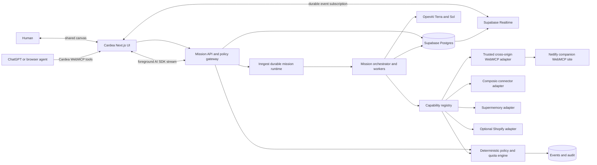

# Cardea architecture

Status: approved architecture contract for the WebMCP Challenge MVP.

This document is the backend source of truth for Cardea. Read `AGENTS.md`, `DESIGN.md`, and `docs/PRODUCT_FLOW.md` first. Backend agents must preserve the generic core described here and must not hardcode the relocation demo, home goods, Shopify, or any other domain into the runtime.

## Architecture thesis

Cardea is a domain-agnostic mission runtime with a spatial interface. A mission is expressed as typed goals, constraints, capabilities, nodes, dependencies, events, approvals, and evidence. Domains are demo data or capability adapters, never core enums.

WebMCP is the primary interaction protocol in both directions:

1. Cardea exposes its live canvas as narrow WebMCP tools that ChatGPT or another browser agent can call.
2. Cardea can discover and execute tools from explicitly trusted cross-origin WebMCP documents embedded in the canvas.

MCP and authorized APIs complement WebMCP for backend integrations. Browser automation and Cloudflare edge WebMCP remain deferred until the core two-way WebMCP journey is stable.

## Locked stack

| Concern | Choice | Role |
|---|---|---|
| Application | Next.js 16.3.3 App Router | Web application and server routes |
| Package manager | pnpm 10.32.1 | Dependency and workspace consistency |
| UI agent framework | Vercel AI SDK 6 | Streaming, typed tools, model routing, UI integration |
| Models | GPT-5.6 Terra default, GPT-5.6 Sol escalation | Cost-aware planning and difficult reasoning |
| Durable execution | Inngest | Checkpoints, retries, approvals, subagents, concurrency, observability |
| Auth and canonical data | Supabase Auth + Postgres | Users, missions, events, approvals, audit, RLS |
| Background realtime | Supabase Realtime | Durable mission-event delivery to clients |
| Foreground realtime | AI SDK streaming | Immediate Cardea response and typed UI parts |
| Long-term memory | Supermemory | User-scoped retrieval, versioning, deletion |
| User app connectors | Composio | Managed OAuth and scoped Gmail, Calendar, and related tools |
| Commerce | Optional narrow Shopify MCP/WebMCP spike | Search and cart preparation only, not critical path |
| External WebMCP demo | Companion site on a separate Netlify origin | Real cross-origin discovery and execution |
| Primary deployment | Vercel | Cardea application and Next.js runtime |
| Telemetry | Redacted OpenTelemetry | Cross-system traces, latency, tokens, cost, tools, approvals |

No dependency may be installed and no external service may be configured or authenticated without user authorization.

## System diagram



## Generic domain model

### Core objects

```ts
type Mission = {
  id: string;
  ownerId: string;
  title: string;
  status: "draft" | "planning" | "running" | "waiting" | "completed" | "failed" | "cancelled";
  mandateVersion: number;
  rootNodeId: string | null;
  createdAt: string;
  updatedAt: string;
};

type Mandate = {
  missionId: string;
  version: number;
  goal: string;
  constraints: Constraint[];
  authority: AuthorityPolicy;
  selectedContextCardIds: string[];
  createdBy: "user" | "cardea";
};

type MissionNode = {
  id: string;
  missionId: string;
  parentId: string | null;
  codename: string;
  roleLabel: string;
  objective: string;
  status: NodeStatus;
  requiredCapabilities: CapabilityRequirement[];
  inputRefs: string[];
  outputRefs: string[];
  version: number;
};

type MissionEdge = {
  id: string;
  missionId: string;
  fromNodeId: string;
  toNodeId: string;
  kind: "depends_on" | "blocks" | "informs" | "approves";
  condition?: JsonValue;
};

type Capability = {
  id: string;
  provider: "internal" | "webmcp" | "mcp" | "composio" | "shopify";
  name: string;
  description: string;
  inputSchema: JsonSchema;
  outputSchema?: JsonSchema;
  risk: RiskDescriptor;
  trust: TrustDescriptor;
};
```

The demo may seed nodes with roles such as Housing or Travel, but the planner creates roles from the user's goal and the capabilities available at runtime. No database enum or switch statement may assume a fixed domain list.

### Context cards

Context cards are user-owned containers, not agent identities:

```ts
type ContextCard = {
  id: string;
  ownerId: string;
  name: string;
  description?: string;
  connectorRefs: string[];
  memoryScopes: string[];
  authorityOverrides?: Partial<AuthorityPolicy>;
  visualTheme: string;
};
```

Starter cards are fixture data. Users may create arbitrary cards.

## Event-sourced state

Supabase stores an append-only mission-event log and materialized current state.

### Event envelope

```ts
type MissionEvent<T = JsonValue> = {
  id: string;
  missionId: string;
  nodeId?: string;
  sequence: number;
  type: MissionEventType;
  actor: { kind: "user" | "cardea" | "tool" | "system"; id: string };
  correlationId: string;
  causationId?: string;
  idempotencyKey?: string;
  payload: T;
  trust: "trusted" | "untrusted" | "derived";
  createdAt: string;
};
```

Minimum event families:

- mission created, mandate proposed, mandate revised, mandate approved;
- node planned, node started, node paused, node resumed, node redirected;
- capability discovered, tool requested, tool approved, tool started, tool completed, tool failed;
- evidence recorded, memory proposed, memory promoted, memory edited, memory forgotten;
- approval requested, approval resolved, approval expired;
- dependency added, dependency removed, dependency rerouted;
- checkpoint created, node reverted, mission reverted;
- quota consumed, policy denied, security event recorded;
- mission completed, mission failed, mission cancelled.

### Materialization

- Postgres transactions append the event and update materialized mission/node/approval rows atomically.
- Client reads materialized state for fast initial load.
- Supabase Realtime publishes committed mission events for background updates.
- Replay rebuilds a mission from ordered events and verifies the stored materialization.
- Revert creates compensating events or restores an approved checkpoint. It never deletes audit history.

## Agent harness

### Topology

Use one lightweight mission orchestrator and bounded specialist workers.

- Orchestrator plans, maintains dependencies, selects capabilities, compiles context, and evaluates completion.
- Workers own one node objective and may call only capabilities granted to that node.
- Spawn workers only when branches are genuinely independent.
- Default maximum active durable steps is five to fit Inngest Hobby concurrency.
- The orchestrator never sends the full transcript to every worker.
- Workers return structured artifacts and concise summaries, not free-form hidden reasoning.

### Model routing

- GPT-5.6 Terra is the default planner and worker model.
- GPT-5.6 Sol is an escalation, not a user-visible model choice.
- Escalate only when a deterministic router detects one or more of:
  - repeated plan validation failure;
  - high dependency depth or conflicting constraints;
  - consequential recommendation with material uncertainty;
  - tool failure requiring nontrivial replanning;
  - evaluator score below threshold after one bounded repair.
- Record model, reasoning effort, token usage, latency, and reason for escalation.
- Start Terra at low or medium reasoning based on node risk. Sol uses medium by default and higher only for a bounded hard case.

### Budgets

Every mission and node has explicit limits:

- maximum model calls;
- maximum input and output tokens;
- maximum wall-clock duration;
- maximum tool calls;
- maximum retries;
- maximum concurrent workers;
- maximum provider cost;
- maximum untrusted-content bytes.

Budget exhaustion creates a visible event and either degrades to a cheaper path or asks the user. It never loops indefinitely.

### Durable execution

Inngest owns long-running control flow:

- `step.run()` wraps each model call, capability discovery, tool call, policy check, and state commit that must be checkpointed.
- `step.invoke()` runs bounded node workers and independent branches.
- `step.waitForEvent()` suspends for human approval or OAuth completion.
- Completed steps are memoized so retries do not repay earlier model or tool work.
- Tool side effects still require Cardea idempotency keys because workflow durability alone does not create exactly-once external effects.

## Context compiler

Every model request is assembled from typed, bounded sections:

1. Immutable system and security instructions, prompt-cached.
2. Current mandate version and authority policy.
3. Current node objective, status, dependency inputs, and budget.
4. Minimal materialized mission summary.
5. Relevant evidence, each with provenance and trust label.
6. Relevant Supermemory results scoped to selected context cards and user.
7. Available capability descriptors filtered to the node.
8. Output schema and completion criteria.

Rules:

- Never resend the complete mission transcript by default.
- Retrieve memory and evidence with metadata filters before semantic ranking.
- Deduplicate and cap each source class.
- Store compact structured summaries at node completion and checkpoint boundaries.
- Cache stable instructions and schemas by version hash.
- Prefer tool search or meta-tool discovery over loading hundreds of schemas.
- Reject a call before dispatch when its estimated token or cost budget is exceeded.

## Capability registry and adapters

The registry normalizes discovered tools without erasing provider-specific security data.

```ts
interface CapabilityAdapter {
  discover(ctx: DiscoveryContext): Promise<Capability[]>;
  execute(request: CapabilityRequest): Promise<CapabilityResult>;
  cancel?(executionId: string): Promise<void>;
  verify?(result: CapabilityResult): Promise<VerificationResult>;
}
```

Every request passes through:

`schema validation -> quota -> policy -> approval if required -> idempotency -> execute -> verify -> event commit`

Adapters cannot bypass policy or write mission state directly.

## Cardea WebMCP surface

Use `document.modelContext`, not deprecated `navigator.modelContext` examples.

Expose eight narrow tools:

1. `create_mission`
   - Creates a draft goal and optionally opens the mandate sheet.
   - Never starts consequential external actions.
2. `inspect_canvas`
   - Returns bounded mission, branch, dependency, state, and pending-decision summaries.
   - Read-only.
3. `update_mandate`
   - Proposes constraint, context-card, or authority changes.
   - Requires normal application validation.
4. `focus_node`
   - Selects and opens one node in the visible canvas.
   - Read-only UI state.
5. `redirect_node`
   - Adds a scoped user instruction and triggers bounded replanning.
6. `set_node_state`
   - Supports typed `pause`, `resume`, `retry`, or `revert` operations with state validation.
7. `resolve_approval`
   - Accepts, modifies, or rejects a specific pending approval.
   - Consequential and always policy checked.
8. `open_takeover`
   - Opens the visible takeover interface for the user.
   - Does not claim remote control when no live browser exists.

Each tool must have:

- precise description and non-overlapping responsibility;
- narrow JSON Schema with size and enum constraints;
- current-session auth and ownership check;
- explicit `readOnlyHint` and `untrustedContentHint` where applicable;
- abort handling;
- deterministic result shape with IDs, state version, and user-visible effect;
- unit test, browser discovery test, execution test, and selection eval.

Tool outputs are bounded and must not return complete transcripts, secrets, raw connector payloads, or private model reasoning.

## External WebMCP companion

The MVP companion is a small capability-oriented site on a separate Netlify origin. Its sample content may support the relocation demo, but its implementation remains a generic catalog and cart domain fixture.

### Cross-origin contract

- Cardea embeds the companion with `<iframe allow="tools">`.
- The companion registers tools with `exposedTo` containing Cardea's exact production origin.
- Cardea calls `document.modelContext.getTools({ fromOrigins: [companionOrigin] })`.
- Cardea executes only returned registered tool handles through `document.modelContext.executeTool()`.
- Both origins use HTTPS and explicit allowlists.
- Companion CSP `frame-ancestors` permits only Cardea's origin.
- Cardea CSP `frame-src` permits only the companion origin and other reviewed sources.
- Neither site sets `document.domain`; maintain origin isolation.
- Development and preview origins require explicit configuration, never wildcards in production.

### Companion tools

Keep the companion surface small and reversible:

- search a catalog;
- inspect one item;
- compare selected items;
- prepare or update a simulated cart;
- read store policies.

No real payment, purchase, customer account, or sensitive data is required. The canvas must visibly show discovery, structured execution, and returned state.

## Composio

- One stable Cardea user ID maps to Composio's user/session identity.
- Create mission-scoped sessions restricted to required toolkits and exact tools.
- OAuth uses hosted Connect Links or the official supported flow.
- Missing integration pauses the node and resumes through a verified callback event.
- Never expose the Composio project key or connected-account credentials to the browser or model.
- Gmail, Calendar, and similar data enter the evidence zone as untrusted external content.
- Consequential sends or writes still pass Cardea policy and approval.

## Supermemory

- Use one stable container scope per Cardea user, with narrower metadata for context-card and mission scope.
- Keep the full API key server-side; use scoped keys only where the current SDK supports the required boundary.
- Disable silent automatic memory saving for the MVP.
- Cardea proposes a memory with source and influence; the user promotes it.
- Persist the Supermemory ID, version, source, context-card association, and deletion status in Supabase.
- Edit, forget, and delete operations update both systems through idempotent durable steps.
- Supermemory is retrieval infrastructure, not the mission database.

## Optional Shopify spike

Shopify is not on the critical path. Time-box it to one day after the two-way WebMCP demo is stable.

Keep only if all pass:

- real catalog search;
- product/variant comparison;
- cart preparation or handoff;
- no checkout completion;
- no duplicated Composio commerce tools;
- reliable demo and documented limits.

If any fail, remove Shopify from the runtime and partner claims without changing the generic capability contract.

## Deterministic policy engine

The model may recommend an action but cannot authorize it.

Inputs:

- current mandate version;
- user and mission authority;
- context-card overrides;
- capability risk descriptor;
- tool annotations;
- requested input and target;
- current quota and budget;
- origin, trust, and evidence provenance;
- prior approvals and idempotency state.

Outputs:

- allow;
- require approval;
- deny;
- require user takeover;
- require reauthentication.

Permanent hard stops include:

- payment or purchase completion;
- legal agreement or signature;
- account, permission, or credential change;
- sensitive outbound message;
- destructive deletion;
- disclosure of protected personal data;
- action outside a declared origin or capability allowlist.

`Free Passage` can reduce approvals only within explicit visible limits. It cannot override permanent hard stops.

## Prompt-injection and trust boundaries

Treat all external page text, WebMCP descriptions and results, MCP responses, emails, documents, catalog content, and user-generated content as untrusted evidence.

### Trust zones

1. Trusted instructions: server-controlled prompts, policy, schemas, and current user mandate.
2. Derived state: validated summaries and materialized events produced by Cardea.
3. Untrusted evidence: external content stored with origin, timestamp, digest, and byte limits.
4. Action requests: typed proposals that must pass schema, policy, quota, and approval.

Rules:

- Untrusted evidence never becomes a system or developer instruction.
- Extract factual fields into strict schemas before planning with them.
- Preserve provenance and quote the smallest needed excerpt.
- Limit bytes, tokens, nested objects, redirects, and tool-result count.
- Strip active markup and never execute supplied scripts.
- Prevent SSRF with scheme, DNS, redirect, IP-range, port, and origin allowlists.
- Reject instructions inside evidence that request secrets, policy changes, tool expansion, or data exfiltration.
- Use separate model calls for extraction and action planning when content risk is high.
- Mark appropriate WebMCP output with `untrustedContentHint`.
- Evaluate indirect prompt-injection scenarios before release.

## Authentication, authorization, and RLS

- Use Supabase SSR auth with secure HTTP-only cookie sessions.
- Every canonical row includes owner or tenant identity.
- Enable RLS on every user-accessible table before production data exists.
- Browser clients receive only anon/publishable credentials and RLS-scoped access.
- Supabase service-role credentials remain server-side and only in trusted jobs/routes.
- Inngest webhook and event endpoints verify signatures.
- OAuth callback state is signed, short-lived, and bound to user, mission, provider, and return origin.
- Public demo data lives in a separate tenant or immutable fixture scope.
- Judge codes are hashed and compared server-side.

## Rate limits and usage

Use layered limits rather than one request counter:

- user account;
- signed guest session;
- IP as an abuse signal, never sole identity;
- mission creations per window;
- concurrent active missions;
- concurrent node workers;
- model tokens and estimated cost;
- expensive capability calls;
- OAuth attempts;
- WebMCP tool calls;
- companion-site calls;
- approval attempts;
- global provider circuit breakers.

MVP defaults:

- public signed guest: one mission;
- judge code: up to ten mission runs;
- Inngest active durable steps: maximum five;
- provider-specific calls: conservative burst and daily budgets;
- hard cost ceiling per mission, with visible stop event.

Use atomic counters or transactional usage rows. Never enforce quota solely with local storage.

## Realtime delivery

### Foreground

AI SDK streams the immediate Cardea reply and typed UI parts while the initial request is active.

### Background

Inngest commits durable mission events to Supabase. Supabase Realtime delivers committed events to authorized clients. Clients reconcile by sequence number and refetch materialized state on a gap, reconnect, or version conflict.

Rules:

- At-least-once delivery is expected; reducers must deduplicate by event ID and sequence.
- UI never treats a streamed preview as committed until the durable event arrives.
- Approval resolution uses optimistic feedback only after the server reserves the approval atomically.
- Reconnect resumes from the last committed sequence.

## Idempotency, retries, and recovery

- Every side-effect request has a deterministic idempotency key scoped to mission, node, capability, action, and mandate version.
- Retry only safe failures and provider-declared retryable responses.
- Use bounded exponential backoff with jitter.
- Circuit-break a failing provider and emit a visible event.
- Verify outcome after any uncertain network response before retrying.
- Purchases, sends, signatures, permission changes, and destructive operations never retry silently.
- Partial progress remains committed and inspectable.

## Observability

Emit redacted OpenTelemetry spans with shared correlation IDs across:

- inbound WebMCP call;
- API request;
- mission and node run;
- context compilation;
- model call;
- capability discovery and execution;
- policy and approval;
- Supabase transaction;
- Inngest step;
- realtime delivery;
- companion WebMCP execution.

Record model, reasoning effort, cached input, tokens, cost estimate, latency, retries, tool name, result status, and escalation reason. Never record secrets, OAuth tokens, full emails/documents, protected personal data, or raw hidden reasoning. Apply field-level redaction before export.

## Secrets and environment contract

Values belong in local `.env.local` or provider secret stores, never Git, prompts, screenshots, logs, or documentation.

Expected variable names, subject to exact provider docs during setup:

- `OPENAI_API_KEY`
- `NEXT_PUBLIC_SUPABASE_URL`
- `NEXT_PUBLIC_SUPABASE_PUBLISHABLE_KEY`
- `SUPABASE_SERVICE_ROLE_KEY`
- `INNGEST_EVENT_KEY`
- `INNGEST_SIGNING_KEY`
- `COMPOSIO_API_KEY`
- `SUPERMEMORY_API_KEY`
- `CARDEA_APP_ORIGIN`
- `CARDEA_COMPANION_ORIGIN`
- `CARDEA_JUDGE_CODE_HASH`
- optional Shopify variables only if the spike lands.

The setup agent must verify current official names and avoid printing values.

## Deployment topology

### Cardea

- Vercel project for Next.js.
- Supabase for auth, Postgres, RLS, and Realtime.
- Inngest Cloud Hobby for durable execution.
- OpenAI, Composio, and Supermemory called only from trusted server execution.

### Companion WebMCP site

- Separate Netlify site and secure origin.
- Static or minimal server state sufficient for the simulated catalog/cart.
- Exact Cardea origin allowlisted for cross-origin tool exposure.
- No real credentials or payments.

### Deferred

- Cloudflare Browser Run.
- Cloudflare Workers/Durable Objects mission runtime.
- Cloudflare edge WebMCP enhancement.
- Netlify published canvases.
- Full Shopify checkout.
- Code-execution sandbox.

## Security headers

Final values depend on deployed origins, but architecture requires:

- strict Content Security Policy with explicit `frame-src`, `frame-ancestors`, `connect-src`, and script strategy;
- `Origin-Agent-Cluster: ?1` and no `document.domain` relaxation;
- HSTS on production;
- `X-Content-Type-Options: nosniff`;
- restrictive `Referrer-Policy`;
- least-privilege `Permissions-Policy`, including WebMCP `tools` delegation only where required;
- secure, HTTP-only, SameSite cookies appropriate to the auth flow.

Test headers in both Cardea and companion deployments before claiming cross-origin WebMCP works.

## Verification gates

### Unit

- schemas and bounded parsers;
- policy matrix and permanent hard stops;
- quota and cost budgets;
- event reducers and replay;
- context compiler selection and token limits;
- model escalation router;
- capability normalization;
- idempotency-key construction;
- trust-zone and prompt-injection filtering.

### Integration

- Supabase Auth SSR and RLS isolation;
- event append plus materialization atomicity;
- Realtime reconnect and deduplication;
- Inngest retry, resume, parallel invoke, and approval wait;
- Composio OAuth pause/resume with restricted tools;
- Supermemory propose/promote/edit/forget;
- companion iframe discovery and execution;
- quota across guest and judge flows.

### WebMCP

- discovery in ChatGPT built-in browser and compatible Chrome;
- exact eight Cardea tools registered;
- JSON Schema validation and bounded outputs;
- tool selection evals for ambiguous prompts;
- cancellation and unregister lifecycle;
- cross-origin companion `allow`, `fromOrigins`, and `exposedTo` behavior;
- prompt-injection and malicious tool-output scenarios;
- consequential confirmation cannot be bypassed.

### Golden journey

- public visitor opens relocation demo;
- agent creates or inspects a Cardea mission through WebMCP;
- Cardea discovers and executes one companion WebMCP tool;
- canvas receives a durable event and visibly updates;
- a dependency changes and reroutes;
- user focuses and redirects one node;
- Needs You approval pauses and resumes;
- completion artifact is replayable;
- no real purchase, signature, or sensitive send occurs.

## Backend workspace boundaries

Recommended implementation workspaces after this document lands:

1. **Core data and policy**
   - Supabase schema, migrations, RLS, event store, materializers, quota, approval, audit.
2. **Mission harness**
   - AI SDK, model router, context compiler, Inngest orchestration, generic capability registry.
3. **WebMCP loop**
   - Cardea tool registration and tests, companion Netlify site, cross-origin adapter.
4. **Connectors and memory**, only after the walking skeleton
   - Composio and Supermemory; optional Shopify spike last.

Keep no more than three active implementation workspaces. Land Core contracts first or provide an explicit shared branch dependency.

## Official documentation

- [WebMCP specification](https://webmachinelearning.github.io/webmcp/)
- [Chrome WebMCP imperative API](https://developer.chrome.com/docs/ai/webmcp/imperative-api)
- [Chrome WebMCP security](https://developer.chrome.com/docs/ai/webmcp/secure-tools)
- [Chrome browser-agent security](https://developer.chrome.com/docs/agents/security)
- [OpenAI WebMCP guide](https://learn.chatgpt.com/docs/webmcp)
- [Vercel AI SDK](https://ai-sdk.dev/docs/introduction)
- [OpenAI GPT-5.6 models](https://developers.openai.com/api/docs/models/compare)
- [Supabase Next.js](https://supabase.com/docs/guides/getting-started/quickstarts/nextjs)
- [Inngest Next.js](https://www.inngest.com/docs/getting-started/nextjs-quick-start)
- [Inngest durable agents](https://www.inngest.com/docs/learn/durable-agents)
- [Composio](https://docs.composio.dev/docs/quickstart)
- [Supermemory](https://supermemory.ai/docs/quickstart)
- [Shopify WebMCP](https://shopify.dev/docs/api/web-mcp)

