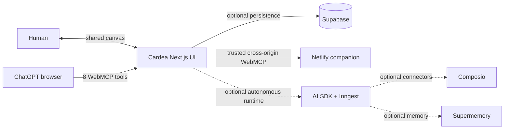

# Cardea

**Your Canvas Beyond the Prompt**

Cardea is a WebMCP-native spatial workspace where a person and an agent can see, steer, and approve complex work together. A prompt becomes a living canvas of dependent work, visible evidence, browser surfaces, approvals, and human takeover.

## Why WebMCP

Chat is effective for expressing intent, but it hides the structure of long-running work. Cardea exposes its live canvas as narrow browser tools, so ChatGPT can operate the same workspace the user sees instead of guessing at buttons or manipulating an invisible backend.

The intended loop is:

`human -> ChatGPT browser -> Cardea WebMCP tools -> visible canvas update -> human judgment`

Cardea also includes a small separate-origin companion site that exposes reversible WebMCP tools, demonstrating the outbound loop without browser automation or payment.

## Verified WebMCP tools

Cardea registers eight tools through `document.modelContext`:

| Tool | Visible effect |
|---|---|
| `create_mission` | Opens a draft mandate from a bounded goal |
| `inspect_canvas` | Returns a bounded read-only mission summary |
| `update_mandate` | Opens a proposed mandate change |
| `focus_node` | Focuses one visible work node |
| `redirect_node` | Opens the composer scoped to a selected node |
| `set_node_state` | Pauses, resumes, retries, or reverts a node |
| `resolve_approval` | Accepts, modifies, or rejects a visible approval |
| `open_takeover` | Opens the visible human takeover surface |

Local Chrome 151 verification confirms that all eight tools are discoverable. Executing `create_mission` changes the same page from the empty canvas to mandate planning, and `inspect_canvas` returns bounded state without an OpenAI API call.

## Product status

- Landing page and `/canvas` are implemented.
- Eight Cardea WebMCP tools are registered and locally browser-verified.
- The canvas has fixture-backed states for deterministic review and a server adapter boundary for live missions.
- Supabase schema, RLS, event sourcing, approvals, checkpoints, quotas, and policy contracts are implemented, but remote migrations require operator credentials before deployment.
- The optional AI SDK/Inngest harness, Composio adapter, and Supermemory adapter are present behind server boundaries. They are enhancements, not requirements for ChatGPT to use the WebMCP interface.
- The companion site is in `apps/companion` and requires a separate Netlify deployment to prove cross-origin WebMCP in production.

## Run locally

Requirements:

- Node.js 22.x
- pnpm 10.32.1
- Chrome 149 or newer with WebMCP testing enabled, or ChatGPT's in-app browser

```bash
pnpm install --frozen-lockfile
pnpm dev
```

Open [http://localhost:3000/canvas](http://localhost:3000/canvas).

The public fixture canvas does not require provider credentials. Live persistence and optional integrations use the environment variables listed in `.env.example` or `ARCHITECTURE.md`; never commit their values.

## Test WebMCP in Chrome

1. Open `chrome://flags/#enable-webmcp-testing` in Chrome 149+.
2. Enable WebMCP testing and restart Chrome.
3. Open the deployed Cardea `/canvas` URL.
4. Use Chrome's WebMCP inspector or a compatible browser agent to list page tools.
5. Confirm the eight names above.
6. Execute `inspect_canvas` with `{}`.
7. Execute `create_mission` with:

```json
{ "goal": "Prepare a launch without publishing anything" }
```

8. Confirm the visible page opens the mandate state.

## Test in ChatGPT

1. Open the deployed Cardea URL in ChatGPT's built-in browser.
2. Ask: `List the tools this page exposes.`
3. Ask: `Create a mission to prepare a launch, but do not publish or spend anything.`
4. Confirm ChatGPT invokes Cardea's site tool and the visible canvas changes.
5. Ask ChatGPT to inspect, focus, redirect, or pause one node and confirm the same canvas responds.

ChatGPT provides the agent for this workflow. An OpenAI API key is needed only when enabling Cardea's optional autonomous backend harness.

## Architecture



The detailed contracts, security model, event schema, and deferred infrastructure are documented in [`ARCHITECTURE.md`](ARCHITECTURE.md).

## Safety model

- The model can recommend an action but cannot authorize it.
- Payments, purchases, signatures, account changes, sensitive messages, destructive deletion, and protected-data disclosure remain hard stops.
- External content is treated as untrusted evidence, not instructions.
- Stateful requests use bounded schemas, ownership checks, policy, quota, and idempotency gates.
- WebMCP outputs never include secrets, raw provider payloads, full transcripts, or hidden reasoning.
- The public fixture never claims a real website, booking, purchase, message, or connector action.

## Verification

```bash
pnpm test:core
pnpm test:harness
pnpm exec next typegen
pnpm exec tsc --noEmit
pnpm lint
pnpm build
```

The current suite covers policy hard stops, quota, idempotency, event replay, approval double settlement, model routing, context budgets, and capability registry behavior.

## Repository map

- `src/app/canvas`: Cardea product experience
- `src/webmcp`: browser tool registration
- `src/core`: event, policy, repository, and Supabase contracts
- `src/harness`: optional AI SDK/Inngest, connector, and memory adapters
- `apps/companion`: separate-origin WebMCP companion site
- `supabase`: migrations and database tests
- `docs`: design, product, architecture, and implementation handoffs

## License

MIT, see [`LICENSE`](LICENSE).
