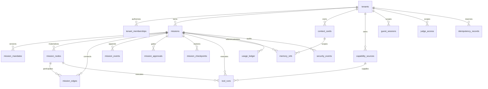

# Cardea Core Data and Policy handoff

Status: application backend implemented, remote migrations intentionally unapplied.

This document is the dependency contract for Mission Harness and WebMCP workspaces. It implements the approved generic core in `ARCHITECTURE.md`. It does not add authentication UI, model calls, orchestration, connector SDKs, prompt processing, or live provider access.

## Schema diagram

Every application row is explicitly tenant-scoped. A user tenant has an owner and optional membership rows. Guest and judge tenants have no user identity. Public demo rows use `public_fixture` scope, are read-only through RLS, and reject updates and deletes through database triggers.

## Migration list

1. `20260826000100_core_schema.sql`
   Creates tenant scope, all required tables, generic idempotency records, composite tenant foreign keys, bounds, uniqueness constraints, and indexes.
2. `20260826000200_transactions_and_guards.sql`
   Creates append-only and immutable-fixture triggers plus atomic functions for user tenant creation, mission creation, event append and materialization, approval request and resolution, checkpoint creation and restore, idempotency, usage, guest quota, judge quota, and security events.
3. `20260826000300_rls_and_realtime.sql`
   Enables RLS on every application table, replaces default grants with least-privilege grants, creates read and write policies, restricts function execution, and adds `mission_events` to the local `supabase_realtime` publication when available.

No seed migration is included. The existing relocation journey remains an explicitly disclosed application fixture and is not presented as database data.

## Table and RLS summary

| Table | Purpose | Client access |
| --- | --- | --- |
| `tenants` | User, guest, judge, public fixture, and system isolation | Scoped read only |
| `tenant_memberships` | Tenant authorization | Scoped read only |
| `missions` | Current mission materialization and sequence cursor | Scoped read, RPC writes |
| `mission_mandates` | Immutable mandate versions and authority | Scoped read, RPC writes |
| `mission_nodes` | Generic current node state | Scoped read, RPC writes |
| `mission_edges` | Generic dependency graph | Scoped read, RPC writes |
| `mission_events` | Ordered append-only event log | Scoped read, RPC append only |
| `mission_approvals` | Consequential action gate | Scoped read, atomic RPC settlement |
| `mission_checkpoints` | Append-only restore snapshots | Scoped read, RPC writes |
| `capability_sources` | Normalized capability descriptors and trust | Scoped CRUD |
| `tool_runs` | Redacted execution state and operation identity | Scoped read, server writes |
| `context_cards` | User-owned context, connector references, and authority narrowing | Scoped CRUD |
| `memory_refs` | External memory references and consent state | Scoped CRUD |
| `usage_ledger` | Append-only quota and cost debits | Scoped read, atomic RPC append |
| `guest_sessions` | Signed guest hash and one-mission default | Server only |
| `judge_access` | Judge-code hash and ten-run maximum | Server only |
| `security_events` | Append-only redacted security audit | Authenticated scoped read, RPC append |
| `idempotency_records` | Generic side-effect reservation and terminal result reference | RPC only |

The `anon` role can only select rows in `public_fixture` tenants. The `authenticated` role can select its owned or member tenant rows. Direct mission, event, approval, checkpoint, usage, tool-run, guest, judge, and security mutations are not granted. User-managed context cards, capability descriptors, and memory references have separate insert, update, and delete policies.

Service-role access is intentionally represented only as restricted database function execution. The future SDK client and credential must remain in a server-only data access layer.

## Type and repository contracts

- `src/core/contracts/types.ts` contains generic mission, mandate, node, edge, event, approval, checkpoint, capability, context-card, memory-reference, tool-run, usage, security, authority, quota, and budget contracts.
- `src/core/contracts/validation.ts` provides dependency-free bounded parsers for external inputs and event envelopes.
- `src/core/database.types.ts` is a hand-authored Supabase database type map matching these migrations. Regenerate and compare it from the confirmed Cardea project or local stack before remote deployment.
- `src/core/repositories/mission-repository.ts` defines read, event, approval, checkpoint, usage, security, and aggregate repository interfaces.
- `src/core/repositories/mission-service.ts` applies deterministic policy before an approval or denial event is persisted.
- `src/core/server/database.ts` is the provider-neutral, `server-only` database port.
- `src/core/server/supabase-mission-repository.ts` is the live Supabase implementation for reads, events, approvals, checkpoints, usage, and audit.
- `src/lib/supabase` contains request-scoped browser, server, admin, auth, and proxy clients. Service credentials never cross the server boundary.

Live route handlers:

- `POST /api/missions` creates a personal tenant if needed, then atomically creates a mission, mandate, and first event.
- `GET /api/missions/:missionId` returns an RLS-scoped mission snapshot.
- `GET /api/missions/:missionId/events?after=<sequence>` returns up to 500 ordered committed events.
- `POST /api/missions/:missionId/events` appends and materializes a bounded event with optimistic sequence control.
- `POST /api/approvals/:approvalId/resolve` settles an approval once.
- `GET /api/session` exposes only authenticated state and user ID.
- `GET /auth/callback` completes PKCE code exchange or a bounded email OTP callback.

The existing `MissionFixtureAdapter` is preserved. It now extends the generic `MissionReadRepository` and delegates `getRelocationMission()` to the generic `getMission("relocation-demo")` method. Product components and visual files are unchanged.

## Transaction functions

| Function | Guarantee |
| --- | --- |
| `ensure_user_tenant` | Creates or returns exactly one personal tenant for the authenticated user |
| `create_mission` | Creates mission, mandate version 1, and event sequence 1 atomically |
| `append_mission_event` | Locks mission sequence, rejects stale writers, deduplicates exact retries, appends an event, and updates materialized mission, node, edge, or mandate state atomically |
| `request_mission_approval` | Appends the request and creates one pending exact-action approval atomically |
| `resolve_mission_approval` | Row-locks the approval, settles it once, and appends one resolution event; an identical retry returns the original result |
| `create_mission_checkpoint` | Stores a bounded digest-addressed snapshot with its event |
| `revert_mission_to_checkpoint` | Restores mission and node materialization and appends a compensating event without deleting history |
| `reserve_idempotency` | Binds one operation key to one request fingerprint |
| `complete_idempotency` | Moves a reservation into an allowed terminal or retryable state |
| `consume_usage` | Serializes a subject-window debit, checks quantity and cost ceilings, and writes once |
| `reserve_guest_mission` | Consumes one of a signed guest session's server-side mission slots |
| `reserve_judge_run` | Consumes one judge run up to the stored maximum of ten |
| `record_security_event` | Stores a bounded redacted security event with an optional hashed IP abuse signal |

Every function that can return stored data checks tenant authorization first. Side-effect identity is based on deterministic operation keys and request fingerprints, not retries or workflow state alone.

Authenticated browser sessions can execute only tenant creation, mission creation, exact user-control events, approval resolution, and checkpoint restore. User-control event append is limited to cancellation, mandate revision or approval, and node pause, resume, or redirect with matching materialized state. Approval requests, checkpoint creation, idempotency reservations, usage debits, and security audit writes require the server-only secret role.

## Policy matrix

The pure decision function returns `allow`, `require_approval`, `deny`, `require_takeover`, or `require_reauthentication`.

| Condition | Decision | Free Passage effect |
| --- | --- | --- |
| Capability, origin, or target is outside the mandate allowlist | `deny` | None |
| Quota or cost budget is exhausted | `deny` | None |
| Idempotency key conflicts or a terminal attempt is retried | `deny` | None |
| Identical operation already succeeded | `allow`, replay stored result | No side effect repeats |
| Legal agreement, signature, or explicit user-presence tool | `require_takeover` | None |
| Account, credential, or permission change without fresh auth | `require_reauthentication` | None |
| Payment, purchase, sensitive outbound message, destructive deletion, protected-data disclosure | `require_approval` until an exact current approval exists | Cannot reduce |
| Critical-risk capability | `require_takeover`, or `deny` without a takeover path | None |
| High risk, untrusted capability, or mandate approval category | `require_approval` | Cannot reduce unless an exact approval already exists |
| External side effect outside explicit limits | `require_approval` | Can reduce only when explicitly allowed |
| Bounded read or action inside explicit authority | `allow` | May reduce ordinary approvals |

Context-card authority overrides only narrow the mandate. Array permissions are intersected, booleans are combined restrictively, cost ceilings take the lower value, and approval categories are unioned.

## Event catalogue

`src/core/events/catalogue.ts` is the exhaustive event registry and identifies which events materialize state. The event families are:

- Mission: created, completed, failed, cancelled, reverted.
- Mandate: proposed, revised, approved.
- Node: planned, started, paused, resumed, redirected, completed, failed, reverted.
- Capability and tool: discovered, requested, approved, started, completed, failed.
- Evidence and memory: evidence recorded, memory proposed, promoted, edited, forgotten.
- Approval: requested, resolved, expired.
- Dependency: added, removed, rerouted.
- Recovery and controls: checkpoint created, quota consumed, policy denied, security recorded.

The TypeScript replay reducer requires sequence 1, rejects gaps, duplicates, tenant crossings, mission crossings, and approval double settlement. Revert applies a prior snapshot while retaining the original and compensating events.

## Realtime contract

The migration uses RLS-protected Postgres Changes for `mission_events`. Consumers must:

1. Deduplicate by event ID and sequence.
2. Apply only the next expected sequence.
3. Refetch the materialized mission on a gap, reconnect, or version conflict.
4. Treat streamed UI previews as uncommitted until the durable event arrives.

Current Supabase guidance recommends Broadcast for greater scale and security. Mission Harness may upgrade delivery to private per-tenant or per-mission Broadcast topics later without changing the event envelope or repository interface.

## Environment contract

Application runtime variables:

- `NEXT_PUBLIC_SUPABASE_URL`
- `NEXT_PUBLIC_SUPABASE_PUBLISHABLE_KEY`
- `SUPABASE_SERVICE_ROLE_KEY`, server-only and only for trusted jobs or routes
- `SUPABASE_SECRET_KEY`, preferred server-only backend key; the legacy variable remains a fallback
- `CARDEA_JUDGE_CODE_HASH`, server-only if the deployment bootstraps judge access from configuration

Operator-only migration variables when a remote deployment is explicitly approved:

- `SUPABASE_ACCESS_TOKEN`
- `SUPABASE_DB_PASSWORD`
- `SUPABASE_PROJECT_REF`

No value belongs in source, prompts, screenshots, logs, committed configuration, or client bundles.

## Verification

Dependency-free tests cover:

- policy allow, denial, approval, takeover boundaries, and permanent hard stops;
- Free Passage restriction;
- quota and cost ceilings;
- event ordering, replay, and checkpoint restore;
- approval double-submit;
- deterministic idempotency fingerprints;
- cross-user read and write denial.

The pgTAP suite additionally covers RLS, database grants, atomic event materialization, stale sequence rejection, approval settlement, usage idempotency, guest quota, and judge quota. Run it with the commands in `supabase/README.md` once a Docker-compatible runtime is available.

## Unapplied remote steps

No project is linked and no remote command has been run. After the user confirms the exact Cardea project reference:

1. Start and test a local stack.
2. Generate local database types and compare them with `src/core/database.types.ts`.
3. Link only the confirmed Cardea project.
4. Run `supabase db push --dry-run` and review the exact target and migration plan.
5. Request explicit approval to apply.
6. Run `supabase db push` only after that approval.
7. Regenerate types from the deployed schema and run RLS integration tests with two isolated users.

Never link or mutate an unrelated Supabase project.

## Risks and blockers

- The installed Supabase CLI is available, but no Docker-compatible runtime is present. The migrations and pgTAP tests could not be executed against local Postgres in this workspace.
- `@supabase/supabase-js@2.112.4` and `@supabase/ssr@0.12.5` are pinned MIT-licensed runtime dependencies. Their request-scoped implementation uses secure cookie sessions and `getClaims()` for identity checks.
- Postgres Changes is suitable for the walking skeleton. Broadcast is the recommended follow-up before higher-scale realtime claims.
- `database.types.ts` is hand-authored and must be regenerated and diffed once the schema can run locally or the exact Cardea project is approved.

## Next workspace dependency contract

Mission Harness and WebMCP workers must consume only:

- the generic contracts in `src/core/contracts`;
- the repository interfaces in `src/core/repositories`;
- deterministic policy decisions from `src/core/policy/engine.ts`;
- deterministic idempotency keys from `src/core/idempotency.ts`;
- the database RPCs listed above;
- ordered committed mission events and materialized snapshots.

Workers must not write mission tables directly, bypass policy, authorize from model output, trust client quota state, repeat a side effect after an uncertain result, expose service-role credentials, or add relocation-specific enums. The Mission Harness workspace should land an authorized Supabase SSR adapter and one thin mission-service path before adding AI SDK or Inngest orchestration. The WebMCP workspace should depend on that service path instead of importing database code.

## Official sources reviewed

- [Supabase SSR client setup](https://supabase.com/docs/guides/auth/server-side/creating-a-client)
- [Supabase Row Level Security](https://supabase.com/docs/guides/database/postgres/row-level-security)
- [Supabase database functions](https://supabase.com/docs/guides/database/functions)
- [Supabase migrations](https://supabase.com/docs/guides/local-development/database-migrations)
- [Supabase database testing](https://supabase.com/docs/guides/database/testing)
- [Supabase Realtime database changes](https://supabase.com/docs/guides/realtime/subscribing-to-database-changes)
- [Supabase TypeScript type generation](https://supabase.com/docs/guides/api/rest/generating-types)
