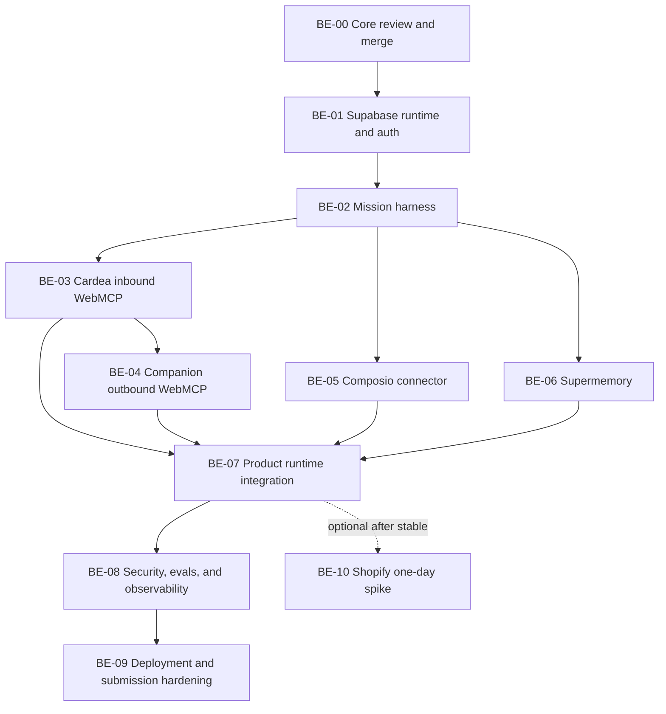

# Cardea backend ticket queue

These tickets convert `ARCHITECTURE.md` into dependency-ordered, independently mergeable work. Every backend workspace must read `AGENTS.md`, `ARCHITECTURE.md`, this index, and its assigned ticket before editing.

## Operating rules

- `origin/main` is the integration base.
- One workspace owns one ticket unless the ticket explicitly authorizes a paired review session.
- Do not hardcode relocation, shopping, or any other domain into the core runtime.
- Do not install dependencies, configure providers, apply remote migrations, or mutate external accounts without user authorization.
- Do not access unrelated private MCPs, projects, databases, or accounts.
- Never print or commit secrets.
- Every implementation ticket ends with focused tests, full typecheck, lint, production build, runtime verification, security review, and a clean handoff.
- Agents commit their branch but do not push or merge to `main`; the control room reviews and lands it.

## Dependency graph

## Ticket order

| Ticket | Outcome | Depends on | Parallel notes |
|---|---|---|---|
| [BE-00](BE-00-core-review.md) | Review and land Core Data and Policy | Architecture on main | Active now |
| [BE-01](BE-01-supabase-runtime.md) | Apply and verify Cardea Supabase runtime and auth | BE-00 | Must land before harness |
| [BE-02](BE-02-mission-harness.md) | Durable generic mission orchestrator | BE-01 | Critical path |
| [BE-03](BE-03-inbound-webmcp.md) | Eight Cardea WebMCP tools | BE-02 | Critical hackathon path |
| [BE-04](BE-04-companion-webmcp.md) | Trusted cross-origin companion WebMCP loop | BE-03 | Can overlap late BE-03 after contract lock |
| [BE-05](BE-05-composio.md) | Scoped Gmail and Calendar connector | BE-02 | Parallel with BE-03/04 |
| [BE-06](BE-06-supermemory.md) | Explicit visible user memory | BE-02 | Parallel with BE-03/04/05 |
| [BE-07](BE-07-product-integration.md) | Replace UI fixtures with live adapters | BE-03/04/05/06 | Integrates all streams |
| [BE-08](BE-08-security-evals-observability.md) | Attack, eval, quota, and trace release gate | BE-07 | Fresh review context required |
| [BE-09](BE-09-deployment-submission.md) | Production and judge hardening | BE-08 | Final 48-hour workspace |
| [BE-10](BE-10-shopify-spike.md) | Optional Shopify search/cart | BE-07 stable | Strictly time-boxed and cuttable |

## Current status

- BE-00 has a committed foundation at `a6813ce` in the `configure-api-credentials` workspace, plus later uncommitted Supabase SDK work. It must finish, sync current main, and pass review before landing.
- BE-01 through BE-10 are ready only after their dependencies land.
- Do not launch BE-02, BE-03, or connector agents against provisional Core contracts.

## Landing gate for every ticket

The handoff must include:

1. Outcome and user/system behavior delivered.
2. Exact commit hash.
3. Changed files and owned contract changes.
4. Commands and tests run.
5. Runtime verification evidence.
6. Security and privacy review.
7. Environment variable names, never values.
8. External mutations and their exact targets.
9. Known limitations and risks.
10. Downstream ticket instructions.

